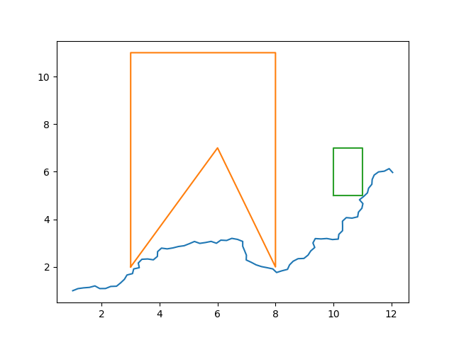

# rrt_cpp
A simple RRT implementation in C++

### Input Data
The main program reads the data about start, goal and obstacles from `input.txt`
- The first line is `x` and `y` coordinates of the start.
- The second line is `x` and `y` coordinates of the goal.
- After that obstacles can be added with each line representing a vertex and empty line closing the obstacle. Multiple obstacles can be added.

### Lookout!
The plotting is done using [matplotlib-cpp](https://github.com/lava/matplotlib-cpp) which throws `segmentation fault` for some reason but it solves the purpose of plotting the final solution. It can be avoided to run the implementation normally.

